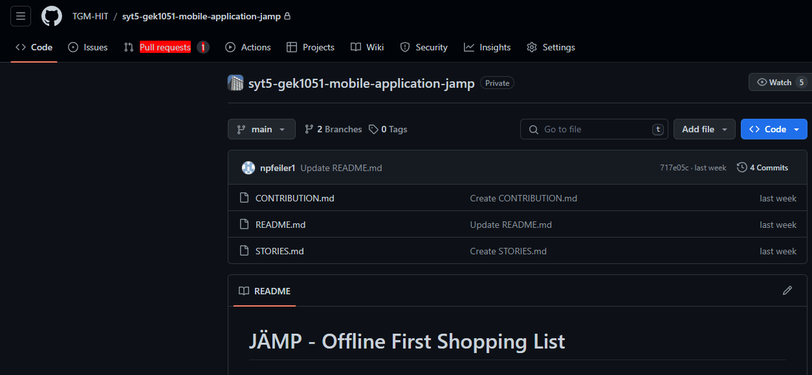

# Wie wir auf Github arbeiten

## Setup

Wir arbeiten mit Pull Requests, dazu siehe [Pull Requests](##Pull Requests). Außerdem haben wir bestimmte Voraussetzungen für unsere Commit-Messages, dazu siehe [Commit-Messages](https://elearning.tgm.ac.at/mod/page/view.php?id=3508). Zuerst bitte lokalen (oder globalen) User setzen:

1. `git config --local user.name "Dein Name"`
2. `git config --local user.email "deine@email.com"`

## Pull Requests

Wir wollen, dass unser `main`-Branch immer funktioniert. D.h. wir wollen verhindern, dass jemand fehlerhaften Code auf den `main`-Branch pusht. Deswegen:

1. Kann man nicht mehr auf den `main`-Branch pushen
2. Muss man einen sogenannten Pull-Request erstellen, um seine Änderungen auf den `main`-Branch zu übertragen

## Wie erstellt man einen Pull-Request?

Bevor man überhaupt beginnt irgendwie zu Programmieren, erstellt man einen eigenen Branch (am besten nach der User-Story benannt, siehe `STORIES.md`). Auf diesem Branch kann man machen was man will. Nachdem die User-Story fertig ist, pusht man seine Änderungen auf dem eigenen Branch. Danach geht man auf Github und geht auf den "Pull Requests-Tab". Dort kann man dann einen Pull-Request erstellen und einen Reviewer anfragen. Ein Reviewer ist die Person, die nochmal über den Code drüberschaut und alles überprüft. Den Reviewer muss man auswählen, sonst macht Github Probleme mit dem mergen. Der Reviewer schaut über den Code und approved die Änderungen, wenn alles passt. Zu guter Letzt kann man seinen eigenen Branch auf den `main`-Branch übertragen (mergen). 

## Wie benenne ich meine Branches?

Es kommt drauf an, wozu der Branch verwendet wird:

- Umsetzung einer User-Story/eines Features: `feature/name-der-user-story`
- Fixen eines Bugs/Fehlers: `fix/name-der-user-story`
- Alles andere: `misc/ein-sinnvoller-name`

## Step-by-Step guide

1. Eigenen branch erstellen: `git checkout -b name-der-user-story`

2. Gewünschte Änderungen machen (User-Story umsetzen)

3. Eigene Änderungen pushen: `git push`

4. Auf Github gehen und zum "Pull-Requests" Tab wechseln

5. Pull-Request erstellen und Reviewer hinzufügen

6. Pull-Request nochmal überprüfen

7. Der Reviewer approved die Änderungen 

8. Pull-Request mergen

9. BITTE DEN BRANCH *NICHT* LÖSCHEN!!!!!

## Test Cases schreiben

Test Cases werden mit Cypress geschrieben. Cypress ist gratis und Open-Source. Lokal können die Tests geschrieben und verwaltet werden, mithilfe der Cypress Cloud kann man die Tests aufzeichnen. Eine ausführliche Erklärung hierfür ist in der Technical Documentation. Die Tests werden unter /test geschrieben. Hier bitte je nach Anforderungen neue Dateien bzw. falls noch nicht vorhanden den /test Ordner erstellen.
